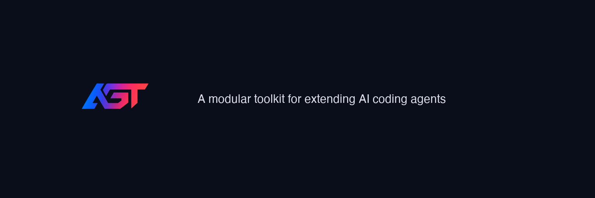

<p align="center">
  <br>
  
  <br><br>
  <a href="https://github.com/jiunbae/agent-skills/stargazers"></a>
  <a href="https://github.com/open330/agt/releases"></a>
  <a href="https://www.npmjs.com/package/@open330/agt"></a>
  <a href="#license"></a>
  
  
  <br><br>
  <a href="#skills-catalog">Skills</a> •
  <a href="#personas">Personas</a> •
  <a href="#hooks">Hooks</a> •
  <a href="#installation">Installation</a> •
  <a href="#contributing">Contributing</a>
  <br>
  <b><a href="README_ko.md">한국어</a></b>
</p>

---

## What is this?

A collection of **skills**, **personas**, and **hooks** for AI coding agents (Claude Code, Codex CLI, Gemini CLI). Each skill is a self-contained markdown module that gives an agent domain-specific capabilities.

> **CLI tool:** Install and manage skills with **[agt](https://github.com/open330/agt)** — `npm install -g @open330/agt`

---

## Quick Start

```bash
# Clone to ~/.agent-skills (agt discovers this automatically)
git clone https://github.com/jiunbae/agent-skills ~/.agent-skills

# Install the agt CLI
npm install -g @open330/agt

# List available skills
agt skill list

# Install a skill to your project
agt skill install kubernetes-skill

# Or use install.sh directly
cd ~/.agent-skills && ./install.sh --core
```

---

## Installation

### With agt CLI (Recommended)

```bash
npm install -g @open330/agt
git clone https://github.com/jiunbae/agent-skills ~/.agent-skills
agt skill install -g git-commit-pr     # Install a skill globally
agt persona install -g --all           # Install all personas globally
```

### With install.sh

```bash
git clone https://github.com/jiunbae/agent-skills ~/.agent-skills
cd ~/.agent-skills

./install.sh --core                    # Core skills only
./install.sh --core --hooks            # Core + hooks
./install.sh all --link-static --codex # Everything
./install.sh --list                    # List available options
```

### Install Options

| Option | Description |
|--------|-------------|
| `--core` | Install core skills globally (recommended) |
| `--link-static` | Symlink `~/.agents` -> `static/` (global context) |
| `--codex` | Codex CLI support (AGENTS.md + skills symlink) |
| `--hooks` | Install Claude Code hooks |
| `--personas` | Install agent personas |
| `--copy` | Copy instead of symlink |
| `--dry-run` | Preview only |
| `--uninstall` | Remove installed skills |

### Core Skills

Installed by default with `--core`:

- `development/git-commit-pr` — Git commit & PR guide
- `context/context-manager` — Project context auto-loader
- `context/static-index` — Global static context index
- `security/security-auditor` — Repository security audit
- `agents/background-implementer` — Background parallel implementation
- `agents/background-planner` — Background parallel planning
- `agents/background-reviewer` — Multi-LLM parallel code review

---

## Skills Catalog

### 🤖 agents/ — AI Agents

| Skill | Description |
|-------|-------------|
| `background-implementer` | Parallel multi-LLM implementation with context safety |
| `background-planner` | Parallel multi-LLM planning with auto-save |
| `background-reviewer` | Multi-LLM parallel code review (security/architecture/quality) |

### 🛠 development/ — Dev Tools

| Skill | Description |
|-------|-------------|
| `context-worktree` | Auto git worktree per task |
| `git-commit-pr` | Git commit & PR generation guide |
| `iac-deploy-prep` | IaC deployment prep (K8s, Dockerfile, CI/CD) |
| `multi-ai-code-review` | Multi-AI code review orchestrator |
| `playwright` | Playwright browser automation |
| `pr-review-loop` | PR review await & auto-fix loop |
| `task-master` | Task Master CLI task management |

### 📊 business/ — Business

| Skill | Description |
|-------|-------------|
| `bm-analyzer` | Business model analysis & monetization strategy |
| `document-processor` | PDF, DOCX, XLSX, PPTX processing |
| `proposal-analyzer` | Proposal / RFP analysis |

### 🔗 integrations/ — Integrations

| Skill | Description |
|-------|-------------|
| `appstore-connect` | App Store Connect automation |
| `discord-skill` | Discord REST API |
| `google-search-console` | Google Search Console API |
| `kubernetes-skill` | Kubernetes cluster management |
| `notion-summary` | Notion page upload |
| `obsidian-tasks` | Obsidian TaskManager (Kanban, Dataview) |
| `obsidian-writer` | Obsidian Vault document upload |
| `service-manager` | Docker container & service management |
| `slack-skill` | Slack app development & API |
| `vault-secrets` | Vaultwarden credentials & API key management |

### 🧠 ml/ — ML/AI

| Skill | Description |
|-------|-------------|
| `audio-processor` | ffmpeg-based audio processing |
| `ml-benchmark` | ML model benchmarking |
| `model-sync` | Model file server sync |
| `triton-deploy` | Triton Inference Server deployment |

### 🔐 security/ — Security

| Skill | Description |
|-------|-------------|
| `security-auditor` | Repository security audit |

### 📁 context/ — Context Management

| Skill | Description |
|-------|-------------|
| `context-manager` | Project context auto-loader |
| `static-index` | Global static context index with user profile |

### 🔧 meta/ — Meta Skills

| Skill | Description |
|-------|-------------|
| `karpathy-guide` | LLM coding error reduction guidelines |
| `skill-manager` | Skill ecosystem management |
| `skill-recommender` | Skill auto-recommender |

---

## Personas

Expert identities as markdown files — usable with **any** AI agent.

| Persona | Role | Domain |
|---------|------|--------|
| `security-reviewer` | Senior AppSec Engineer | OWASP, auth, injection |
| `architecture-reviewer` | Principal Architect | SOLID, API design, coupling |
| `code-quality-reviewer` | Staff Engineer | Readability, complexity, DRY |
| `performance-reviewer` | Performance Engineer | Memory, CPU, I/O, scalability |
| `database-reviewer` | Senior DBA | Query optimization, schema, indexing |
| `frontend-reviewer` | Senior Frontend Engineer | React, accessibility, performance |
| `devops-reviewer` | Senior DevOps/SRE | K8s, IaC, CI/CD |

### Using with agt CLI

```bash
agt persona review security-reviewer --codex
agt persona review security-reviewer --codex "is this architecture scalable?"
agt persona install -g --all
agt persona show security-reviewer
```

### Using Directly

Personas are just `.md` files. Any agent that can read a file can adopt a persona:

```bash
cat personas/security-reviewer.md | codex -q "Review this code"
cat personas/security-reviewer.md   # pipe to any AI agent
```

```
.agents/personas/security-reviewer.md    ← project local (highest priority)
~/.agents/personas/security-reviewer.md  ← user global
personas/security-reviewer.md            ← library (bundled)
```

---

## Hooks

Event-driven automation for Claude Code.

```bash
./install.sh --hooks
```

| Hook | Event | Description |
|------|-------|-------------|
| `english-coach` | `UserPromptSubmit` | Rewrites prompts in natural English with vocabulary |
| `prompt-logger` | `UserPromptSubmit` | Logs prompts to MinIO for analytics |

---

## Creating Skills

```
group/my-skill/
├── SKILL.md           # Required: skill definition
├── scripts/           # Optional: executable scripts
├── references/        # Optional: reference docs
└── templates/         # Optional: template files
```

```bash
mkdir -p development/my-skill
vim development/my-skill/SKILL.md
agt skill install my-skill          # Test install
agt skill list | grep my-skill      # Verify
```

---

## Creating Personas

```bash
agt persona create my-reviewer                       # Empty template
agt persona create rust-expert --ai "Rust unsafe specialist"  # AI-generated
```

---

## Architecture

```
agent-skills/                        open330/agt (CLI tool)
├── agents/       AI agent skills    ├── agt/     Rust CLI
├── development/  Dev tool skills    ├── npm/     npm packaging
├── business/     Business skills    ├── setup.sh Installer
├── integrations/ Integration skills └── assets/  Branding
├── ml/           ML/AI skills
├── security/     Security skills
├── context/      Context management
├── meta/         Meta skills
├── personas/     Expert personas
├── hooks/        Claude Code hooks
├── static/       Global context
├── install.sh    Local installer
└── codex-support/ Codex CLI
```

---

## Contributing

1. **Add a skill** — Create a new skill in the appropriate category
2. **Add a persona** — Create a domain expert persona
3. **Improve docs** — Fix typos, add examples, translate
4. **Report issues** — Bug reports and feature requests welcome

```bash
git clone https://github.com/jiunbae/agent-skills ~/.agent-skills
cd ~/.agent-skills
./install.sh --core
```

For CLI tool contributions, see [open330/agt](https://github.com/open330/agt).

---

## License

MIT License.

---

<p align="center">
  <sub><strong>33</strong> skills | <strong>7</strong> personas | <strong>2</strong> hooks</sub><br>
  <sub>CLI tool: <a href="https://github.com/open330/agt">open330/agt</a></sub>
</p>
