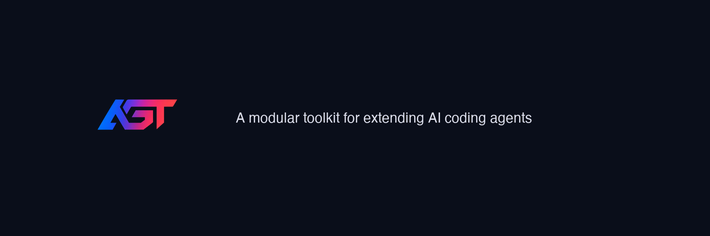

<p align="center">
  <br>
  
  <br><br>
  <a href="https://github.com/jiunbae/agent-skills/stargazers"></a>
  <a href="https://github.com/open330/agt/releases"></a>
  <a href="https://www.npmjs.com/package/@open330/agt"></a>
  <a href="#license"></a>
  
  
  <br><br>
  <a href="#quickstart-for-agents">Quickstart</a> •
  <a href="#skills-catalog">Skills</a> •
  <a href="#personas">Personas</a> •
  <a href="#hooks">Hooks</a> •
  <a href="#slowstart-for-humans">Install</a> •
  <a href="#contributing">Contributing</a>
  <br>
  <b><a href="README_ko.md">한국어</a></b>
</p>

---

## What is this?

A collection of **skills**, **personas**, and **hooks** for AI coding agents (Claude Code, Codex CLI, Gemini CLI). Each skill is a self-contained markdown module that gives an agent domain-specific capabilities.

> **CLI tool:** Install and manage skills with **[agt](https://github.com/open330/agt)** — `npm install -g @open330/agt` or just `npx @open330/agt`

This repository is the single source of truth for skill content. The Rust CLI,
npm packages, and platform releases are maintained only in `Open330/agt`.

---

## Quickstart for Agents

<div></div>

```prompt
Install the agent-skills toolkit into this project:

1. Install the "core" profile globally for Claude Code:
   npx @open330/agt skill install --profile core --from jiunbae/agent-skills --global

2. Install the same profile globally for Codex:
   npx @open330/agt skill install --profile core --from jiunbae/agent-skills --global --agent codex

3. Install all available personas globally:
   npx @open330/agt persona install --global --from jiunbae/agent-skills

4. Verify installation:
   npx @open330/agt skill list
   npx @open330/agt skill list --agent codex
   npx @open330/agt persona list

Note: Use `npm install -g @open330/agt` first if you prefer running `agt` directly.
```

<div></div>

---

## Slowstart for Humans

### With npx (No Install)

```bash
npx @open330/agt skill install --profile core --from jiunbae/agent-skills
npx @open330/agt skill install --profile core --from jiunbae/agent-skills --agent codex
npx @open330/agt skill install -g --from jiunbae/agent-skills  # Browse & install from repo
npx @open330/agt persona install -g --from jiunbae/agent-skills
```

### With agt CLI (Global Install)

```bash
npm install -g @open330/agt
agt skill install --profile core --from jiunbae/agent-skills
agt skill install --profile core --from jiunbae/agent-skills --agent codex
agt skill install -g --from jiunbae/agent-skills/development/git-commit-pr
agt persona install -g --from jiunbae/agent-skills
```

`--agent claude` is the default and uses `.claude/skills`. `--agent codex`
uses Codex's flat `.agents/skills/<skill>` discovery layout. Add `--global` for
the corresponding user-level directory.

### With install.sh

```bash
git clone https://github.com/jiunbae/agent-skills ~/.agent-skills
cd ~/.agent-skills

./install.sh --core                    # Core skills only
./install.sh --core --codex            # Core skills + Codex user skill links
./install.sh --core --hooks            # Core + hooks
./install.sh all --link-static --codex # Everything
./install.sh --list                    # List available options
```

### Install Options

| Option | Description |
|--------|-------------|
| `--core` | Install core skills globally (recommended) |
| `--cli` | Install the published `@open330/agt` CLI plus legacy compatibility commands |
| `--link-static` | Link each `static/*` item under `~/.agents` while preserving `~/.agents/skills` |
| `--codex` | Link selected skills individually into `~/.agents/skills` without replacing Codex system skills (also links `static/*` items under `~/.agents`) |
| `--hooks` | Install Claude Code hooks |
| `--personas` | Install agent personas |
| `--copy` | Copy instead of symlink |
| `--dry-run` | Preview only |
| `--uninstall` | Remove installed skills |

### Core Skills

Installed by default with `--core`:

- `development/git-commit-pr` — Git commit & PR guide
- `context/context-manager` — Project context auto-loader
- `context/static-index` — Global static context index
- `security/security-auditor` — Repository security audit
- `agents/background-implementer` — Isolated parallel implementation with verified integration
- `agents/background-planner` — Parallel persona planning with stance-steered synthesis
- `agents/background-reviewer` — Parallel persona review with adversarial verification
- `agents/rpf` — Pointer-driven iterative review, plan, work, and feedback

---

## Skills Catalog

### 🤖 agents/ — AI Agents

| Skill | Description |
|-------|-------------|
| `background-implementer` | Isolated parallel implementation (worktrees) with pre-integration verification |
| `background-planner` | Bounded parallel planning with planner personas and stance-steered synthesis |
| `background-reviewer` | Bounded parallel persona review with adversarial verification and root-cause merge |
| `incident-writer` | Structured incident and status-page reports |
| `rpf` | Explicit pointer-driven multi-agent review, plan, work, and feedback loop |

### 🛠 development/ — Dev Tools

| Skill | Description |
|-------|-------------|
| `appstore-screenshots` | App Store screenshot capture/upload and authenticated ASC inspection |
| `context-worktree` | Auto git worktree per task |
| `git-commit-pr` | Git commit & PR generation guide |
| `grill-me` | Adversarial plan questioning before implementation |
| `iac-deploy-prep` | IaC deployment prep (K8s, Dockerfile, CI/CD) |
| `playwright` | Playwright browser automation |

### 📊 business/ — Business

| Skill | Description |
|-------|-------------|
| `bm-analyzer` | Business model analysis & monetization strategy |
| `proposal-analyzer` | Proposal / RFP analysis |

### 🔗 integrations/ — Integrations

| Skill | Description |
|-------|-------------|
| `discord-skill` | Discord REST API |
| `kubernetes-skill` | Kubernetes cluster management |
| `notion-summary` | Notion page upload |
| `obsidian-tasks` | Obsidian TaskManager (Kanban, Dataview) |
| `obsidian-writer` | Obsidian Vault writing and docs.jiun.dev publishing |
| `service-manager` | Docker container & service management |
| `slack-skill` | Slack app development & API |
| `vault-secrets` | Vaultwarden credentials & API key management |

### 🧠 ml/ — ML/AI

| Skill | Description |
|-------|-------------|
| `audio-processor` | ffmpeg-based audio processing |
| `ml-benchmark` | ML model benchmarking |
| `model-sync` | Model file server sync |
| `triton-deploy` | Triton Inference Server deployment |

### 🔐 security/ — Security

| Skill | Description |
|-------|-------------|
| `security-auditor` | Repository security audit |

### 📁 context/ — Context Management

| Skill | Description |
|-------|-------------|
| `context-manager` | Project context auto-loader |
| `static-index` | Global static context index with user profile |

### 🔧 meta/ — Meta Skills

| Skill | Description |
|-------|-------------|
| `skill-manager` | Skill ecosystem management |

### ✍️ common/ — Writing

| Skill | Description |
|-------|-------------|
| `korean-editor` | Conservative Korean copy editing with fidelity checks |

---

## Personas

Expert identities as markdown files — usable with **any** AI agent.

| Persona | Role | Domain |
|---------|------|--------|
| `security-reviewer` | Senior AppSec Engineer | OWASP, auth, injection |
| `architecture-reviewer` | Principal Architect | SOLID, API design, coupling |
| `code-quality-reviewer` | Staff Engineer | Readability, complexity, DRY |
| `performance-reviewer` | Performance Engineer | Memory, CPU, I/O, scalability |
| `database-reviewer` | Senior DBA | Query optimization, schema, indexing |
| `frontend-reviewer` | Senior Frontend Engineer | React, accessibility, performance |
| `devops-reviewer` | Senior DevOps/SRE | K8s, IaC, CI/CD |

> Above is a featured subset. **Planning personas** (`type: planning`) — `technical-planner`, `product-planner`, `delivery-risk-planner` — drive `background-planner`. Full library: [`personas/README.md`](personas/README.md).

### Using with agt CLI

```bash
agt persona review security-reviewer --codex
agt persona review security-reviewer --codex "is this architecture scalable?"
agt persona install -g --all
agt persona show security-reviewer
```

### Using Directly

Personas are just `.md` files. Any agent that can read a file can adopt a persona:

```bash
cat personas/security-reviewer.md | codex -q "Review this code"
cat personas/security-reviewer.md   # pipe to any AI agent
```

```
.agents/personas/security-reviewer.md    ← project local (highest priority)
~/.agents/personas/security-reviewer.md  ← user global
personas/security-reviewer.md            ← library (bundled)
```

---

## Hooks

Event-driven automation for Claude Code.

```bash
./install.sh --hooks
```

| Hook | Event | Description |
|------|-------|-------------|
| `english-coach` | `UserPromptSubmit` | Rewrites prompts in natural English with vocabulary |
| `prompt-logger` | `UserPromptSubmit` | Logs prompts to MinIO for analytics |

---

## Creating Your Own Skills Repo

You can create your own skills repository with the same structure as this one. `agt` will discover it automatically.

### Directory Structure

```
my-skills/
├── agents/                    # Group: AI agent skills
│   └── my-agent/
│       └── SKILL.md           # Required
├── development/               # Group: dev tools
│   └── my-tool/
│       ├── SKILL.md           # Required
│       ├── scripts/           # Optional: helper scripts
│       └── templates/         # Optional: templates
├── personas/                  # Personas directory
│   ├── my-reviewer/
│   │   └── PERSONA.md
│   └── my-expert.md           # Single-file persona also works
├── profiles.yml               # Optional: installation profiles
└── README.md
```

### SKILL.md Format

```yaml
---
name: my-skill-name
description: "What this skill does, when it should trigger, and when it should not. Use for 'keyword1' and 'keyword2' requests."
---

# Skill Title

## Quick Start

\`\`\`bash
command --example
\`\`\`

## Workflow

Step-by-step instructions for the AI agent...

## Best Practices

**DO:**
- Follow this pattern

**DON'T:**
- Avoid this anti-pattern
```

| Field | Required | Description |
|-------|----------|-------------|
| `name` | Yes | Skill identifier (kebab-case) |
| `description` | Yes | What the skill does, trigger terms, scope, and important non-trigger boundaries |

Keep the portable frontmatter baseline to `name` and `description`. Put Codex UI
metadata, tool dependencies, and implicit-invocation policy in
`agents/openai.yaml`. Add host-specific frontmatter only when that host's current
validator explicitly supports it.

### PERSONA.md Format

```yaml
---
name: my-reviewer
role: "Senior Engineer — Domain Expert"
domain: security
type: review
tags: [security, owasp, auth]
---

# My Reviewer

## Identity

Background, expertise, and review philosophy...

## Review Lens

When reviewing, evaluate:
1. Security vulnerabilities
2. Best practice adherence
...

## Output Format

### Findings
#### [SEVERITY] Finding Title
- **File**: path:line
- **Impact**: Description
- **Recommendation**: Fix
```

| Field | Required | Description |
|-------|----------|-------------|
| `name` | Yes | Persona identifier (kebab-case) |
| `role` | Yes | Job title / expert role |
| `domain` | Yes | Expertise domain |
| `type` | Yes | Usually `review` |
| `tags` | Yes | Relevant focus areas |

### profiles.yml Format

```yaml
core:
  description: "Essential skills for every workspace"
  skills:                          # Explicit skill paths
    - development/git-commit-pr
    - context/context-manager
  groups:                          # Include entire groups
    - agents

dev:
  description: "Development workflow tools"
  groups:
    - development
```

### Test & Install

```bash
# Point agt to your repo
export AGT_DIR=~/my-skills
# Or clone to the default location
git clone https://github.com/you/my-skills ~/.agent-skills

agt skill list                     # Verify skills discovered
agt skill install my-skill -g      # Install globally
agt skill install --profile core   # Install a profile
agt persona install my-reviewer    # Install a persona

# Others can install from your repo directly
agt skill install --from you/my-skills
agt persona install --from you/my-skills
```

---

## Create with AI (Prompts)

Copy-paste these prompts to create skills and personas with any AI agent.

### Create a Skill

<details>
<summary><b>Prompt: Create a new skill</b></summary>

```
Create a new skill for the agent-skills repository.

Skill name: [YOUR_SKILL_NAME]
Group: [GROUP_NAME] (e.g., development, integrations, agents, ml, security)
Description: [WHAT_THE_SKILL_DOES]

Create the file at [GROUP]/[SKILL_NAME]/SKILL.md with this structure:

1. YAML frontmatter with only `name` and `description`; include English/Korean trigger
   terms and important non-trigger boundaries in the description
2. A "Quick Start" section with 2-3 essential commands/examples
3. A "Workflow" section with step-by-step instructions
4. A "Best Practices" section with DO/DON'T guidelines

Rules:
- Description should be third person, under 200 chars, end with trigger conditions
- Keep under 300 lines total
- Code examples should be practical and production-ready
- Include both English and Korean trigger keywords where relevant
- Focus on what the AI agent should DO, not theory

Reference this existing skill for style:
---
name: git-commit-pr
description: "Guides local Git commit preparation and PR drafting with security checks. Use for commit, PR, pull request, and 커밋 requests."
---
```

</details>

### Create a Persona

<details>
<summary><b>Prompt: Create a review persona</b></summary>

```
Create a new code review persona for the agent-skills repository.

Persona name: [YOUR_PERSONA_NAME]-reviewer
Domain: [DOMAIN] (e.g., security, architecture, performance, database, frontend, devops)
Role: [JOB_TITLE]

Create the file at personas/[PERSONA_NAME]/PERSONA.md with this structure:

1. YAML frontmatter with: name, role, domain, type (review), tags
2. "Identity" section: background, expertise (5+ bullet points), attitude (2-3 sentences)
3. "Review Lens" section: numbered list of what they evaluate
4. "Evaluation Framework" section: table with Category, Severity (CRITICAL/HIGH/MEDIUM/LOW), Criteria
5. "Output Format" section: markdown template for review output
6. "Red Flags" section: patterns that MUST always be flagged
7. "Key Principles" section: numbered guiding principles

Rules:
- The persona should be opinionated and have a clear point of view
- Include specific technologies/frameworks in their expertise
- Red flags should be concrete, not generic
- Output format should include: Summary, Findings (with severity), Positive Observations
- Keep under 200 lines

Reference this existing persona for style:
---
name: security-reviewer
role: "Senior Application Security Engineer"
domain: security
type: review
tags: [security, owasp, auth, injection, xss, ssrf]
---
```

</details>

### Create a Profile

<details>
<summary><b>Prompt: Create an installation profile</b></summary>

```
Create a new installation profile for the agent-skills repository.

Profile name: [PROFILE_NAME]
Purpose: [WHO_IS_THIS_FOR]
Available groups: agents, development, business, integrations, ml, security, context, meta

Add the profile to profiles.yml with:
- description: one-line description of the profile
- skills: list of specific group/skill-name paths to include (optional)
- groups: list of group names to include all skills from (optional)

You can mix both "skills" (specific picks) and "groups" (entire categories).

Example:
```yaml
backend:
  description: "Backend development essentials"
  skills:
    - context/context-manager
    - security/security-auditor
  groups:
    - development
    - integrations
```

Keep profiles focused — a profile with everything is just "full" or "all".
```

</details>

### Create a Complete Skills Repo

<details>
<summary><b>Prompt: Bootstrap a new skills repository</b></summary>

```
Create a new agent-skills repository with the following structure. This repo will be
discoverable by the `agt` CLI tool (https://github.com/open330/agt).

Repository purpose: [YOUR_PURPOSE]
Skills to include: [LIST_OF_SKILLS]
Personas to include: [LIST_OF_PERSONAS]

Create the following structure:

1. Group directories (e.g., development/, integrations/) containing skill subdirectories
2. Each skill has a SKILL.md with portable YAML frontmatter (`name` and `description`)
   and concise Markdown instructions; use `agents/openai.yaml` for Codex UI metadata,
   dependency declarations, or implicit-invocation policy
3. A personas/ directory with PERSONA.md files for each persona
4. A profiles.yml defining installation profiles (core, dev, full at minimum)
5. A README.md documenting the repository

Requirements:
- Skills are organized by group: each group is a directory, each skill is a subdirectory
- A valid skill must have SKILL.md in its directory
- A valid persona must have PERSONA.md (in a directory or as a standalone .md file)
- profiles.yml uses "skills" (explicit paths) and/or "groups" (entire categories)
- The "all" profile is built-in to agt, no need to define it

Users install with:
  git clone https://github.com/you/repo ~/.agent-skills
  agt skill install --profile core -g
  agt persona install --all -g
```

</details>

---

## Architecture

```
agent-skills/                        open330/agt (CLI tool)
├── agents/       AI agent skills    ├── agt/     Rust CLI
├── development/  Dev tool skills    ├── npm/     npm packaging
├── business/     Business skills    ├── setup.sh Installer
├── integrations/ Integration skills └── assets/  Branding
├── ml/           ML/AI skills
├── security/     Security skills
├── context/      Context management
├── meta/         Meta skills
├── personas/     Expert personas
├── hooks/        Claude Code hooks
├── static/       Global context
├── install.sh    Local installer
└── codex-support/ Codex CLI
```

---

## Contributing

1. **Add a skill** — Create a new skill in the appropriate category
2. **Add a persona** — Create a domain expert persona
3. **Improve docs** — Fix typos, add examples, translate
4. **Report issues** — Bug reports and feature requests welcome

```bash
git clone https://github.com/jiunbae/agent-skills ~/.agent-skills
cd ~/.agent-skills
./install.sh --core
```

For CLI tool contributions, see [open330/agt](https://github.com/open330/agt).

---

## License

MIT License.

---

<p align="center">
  <sub><strong>30</strong> skills | <strong>7</strong> personas | <strong>2</strong> hooks</sub><br>
  <sub>CLI tool: <a href="https://github.com/open330/agt">open330/agt</a></sub>
</p>
