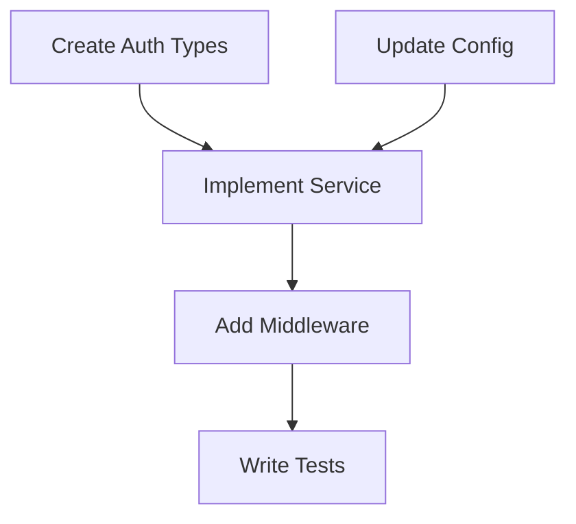

# Dependency Analysis

Plan Executor 스킬의 의존성 분석 알고리즘 문서입니다.

## 개요

작업 스텝 간의 의존성을 분석하여 안전한 병렬 실행 순서를 계산합니다.

## 핵심 알고리즘

### 1. 의존성 그래프 구축

```typescript
interface Step {
  id: string;
  title: string;
  dependencies: string[];  // 이 스텝이 의존하는 스텝 ID들
  status: 'pending' | 'in_progress' | 'completed' | 'failed';
}

interface DependencyGraph {
  nodes: Map<string, Step>;           // 스텝 ID → 스텝 정보
  edges: Map<string, string[]>;       // 스텝 ID → 의존하는 스텝들
  reverseEdges: Map<string, string[]>; // 스텝 ID → 이 스텝에 의존하는 스텝들
  inDegree: Map<string, number>;      // 스텝 ID → 진입 차수
}

function buildGraph(steps: Step[]): DependencyGraph {
  const graph: DependencyGraph = {
    nodes: new Map(),
    edges: new Map(),
    reverseEdges: new Map(),
    inDegree: new Map()
  };

  // 노드 추가
  for (const step of steps) {
    graph.nodes.set(step.id, step);
    graph.edges.set(step.id, step.dependencies);
    graph.reverseEdges.set(step.id, []);
    graph.inDegree.set(step.id, step.dependencies.length);
  }

  // 역방향 엣지 구축
  for (const step of steps) {
    for (const depId of step.dependencies) {
      graph.reverseEdges.get(depId)?.push(step.id);
    }
  }

  return graph;
}
```

### 2. 순환 의존성 검증 (DFS)

```typescript
function detectCycle(graph: DependencyGraph): string[] | null {
  const visited = new Set<string>();
  const recursionStack = new Set<string>();
  const path: string[] = [];

  function dfs(nodeId: string): boolean {
    visited.add(nodeId);
    recursionStack.add(nodeId);
    path.push(nodeId);

    for (const depId of graph.edges.get(nodeId) || []) {
      if (!visited.has(depId)) {
        if (dfs(depId)) return true;
      } else if (recursionStack.has(depId)) {
        // 순환 발견
        const cycleStart = path.indexOf(depId);
        const cycle = path.slice(cycleStart);
        cycle.push(depId); // 순환 완성
        return true;
      }
    }

    path.pop();
    recursionStack.delete(nodeId);
    return false;
  }

  for (const nodeId of graph.nodes.keys()) {
    if (!visited.has(nodeId)) {
      if (dfs(nodeId)) {
        return path; // 순환 경로 반환
      }
    }
  }

  return null; // 순환 없음
}
```

### 3. 위상 정렬 (Kahn's Algorithm)

```typescript
interface Wave {
  level: number;
  steps: string[];  // 이 웨이브에서 병렬 실행 가능한 스텝들
}

function topologicalSort(graph: DependencyGraph): Wave[] {
  const waves: Wave[] = [];
  const inDegree = new Map(graph.inDegree);

  // 진입 차수 0인 노드들로 시작
  let currentLevel: string[] = [];
  for (const [nodeId, degree] of inDegree) {
    if (degree === 0) {
      currentLevel.push(nodeId);
    }
  }

  let level = 0;
  while (currentLevel.length > 0) {
    waves.push({
      level,
      steps: [...currentLevel]
    });

    const nextLevel: string[] = [];

    for (const nodeId of currentLevel) {
      // 이 노드에 의존하는 모든 노드의 진입 차수 감소
      for (const dependentId of graph.reverseEdges.get(nodeId) || []) {
        const newDegree = inDegree.get(dependentId)! - 1;
        inDegree.set(dependentId, newDegree);

        if (newDegree === 0) {
          nextLevel.push(dependentId);
        }
      }
    }

    currentLevel = nextLevel;
    level++;
  }

  return waves;
}
```

## 실행 계획 생성

### 웨이브 기반 실행 계획

```typescript
interface ExecutionPlan {
  waves: Wave[];
  totalSteps: number;
  estimatedTime: string;
  parallelizationRatio: number; // 병렬화 가능 비율
}

function createExecutionPlan(steps: Step[]): ExecutionPlan {
  const graph = buildGraph(steps);

  // 순환 의존성 검사
  const cycle = detectCycle(graph);
  if (cycle) {
    throw new Error(`Circular dependency detected: ${cycle.join(' → ')}`);
  }

  // 위상 정렬
  const waves = topologicalSort(graph);

  // 병렬화 비율 계산
  const parallelWaves = waves.filter(w => w.steps.length > 1).length;
  const parallelizationRatio = parallelWaves / waves.length;

  return {
    waves,
    totalSteps: steps.length,
    estimatedTime: estimateTime(waves),
    parallelizationRatio
  };
}
```

### 시간 추정

```typescript
function estimateTime(waves: Wave[]): string {
  // 각 웨이브의 가장 긴 스텝 시간으로 계산 (병렬 실행)
  let totalMinutes = 0;

  for (const wave of waves) {
    // 웨이브 내 스텝들은 병렬 실행되므로 가장 긴 시간만 계산
    const waveTime = Math.max(...wave.steps.map(getStepEstimate));
    totalMinutes += waveTime;
  }

  if (totalMinutes < 60) {
    return `${totalMinutes} minutes`;
  } else {
    const hours = Math.floor(totalMinutes / 60);
    const minutes = totalMinutes % 60;
    return `${hours}h ${minutes}m`;
  }
}
```

## Mermaid 다이어그램 생성

### 의존성 그래프 시각화

```typescript
function generateMermaidDiagram(graph: DependencyGraph): string {
  let diagram = 'graph TD\n';

  // 노드 정의
  for (const [id, step] of graph.nodes) {
    const label = step.title.replace(/"/g, "'");
    diagram += `    ${id}["${label}"]\n`;
  }

  diagram += '\n';

  // 엣지 정의 (의존성 방향)
  for (const [id, deps] of graph.edges) {
    for (const depId of deps) {
      diagram += `    ${depId} --> ${id}\n`;
    }
  }

  return diagram;
}
```

**출력 예시**:



### 실행 웨이브 시각화

```typescript
function generateWaveDiagram(waves: Wave[]): string {
  let diagram = 'graph LR\n';

  for (let i = 0; i < waves.length; i++) {
    const wave = waves[i];
    const subgraphId = `wave${i + 1}`;

    diagram += `    subgraph ${subgraphId}["Wave ${i + 1}"]\n`;

    for (const stepId of wave.steps) {
      diagram += `        ${stepId}\n`;
    }

    diagram += `    end\n`;

    // 웨이브 간 연결
    if (i < waves.length - 1) {
      diagram += `    ${subgraphId} --> wave${i + 2}\n`;
    }
  }

  return diagram;
}
```

## 최적화 전략

### 1. 의존성 최소화

불필요한 의존성 제거:

```typescript
function optimizeDependencies(steps: Step[]): Step[] {
  // 전이적 의존성 제거
  // A → B → C 에서 A → C 직접 의존성이 있다면 제거

  return steps.map(step => ({
    ...step,
    dependencies: removeTransitiveDeps(step.dependencies, steps)
  }));
}
```

### 2. 병렬화 극대화

의존성 그래프 재구성:

```typescript
function maximizeParallelization(steps: Step[]): Step[] {
  // 가능한 경우 의존성을 공통 조상으로 이동
  // 더 많은 스텝이 동일 웨이브에서 실행될 수 있도록

  return restructureForParallelism(steps);
}
```

### 3. 배치 크기 조절

리소스 제한 고려:

```typescript
function splitWaveIntoBatches(
  wave: Wave,
  maxBatchSize: number = 5
): Wave[] {
  const batches: Wave[] = [];

  for (let i = 0; i < wave.steps.length; i += maxBatchSize) {
    batches.push({
      level: wave.level,
      steps: wave.steps.slice(i, i + maxBatchSize)
    });
  }

  return batches;
}
```

## 에러 처리

### 순환 의존성

```typescript
if (cycle) {
  console.error(`Error: Circular dependency detected!`);
  console.error(`Cycle: ${cycle.join(' → ')}`);
  console.error(`Please review and fix the dependency chain.`);

  // 순환을 끊을 수 있는 지점 제안
  const breakPoint = suggestBreakPoint(cycle);
  console.log(`Suggestion: Consider removing dependency from ${breakPoint}`);
}
```

### 누락된 의존성

```typescript
function validateDependencies(steps: Step[]): string[] {
  const errors: string[] = [];
  const stepIds = new Set(steps.map(s => s.id));

  for (const step of steps) {
    for (const depId of step.dependencies) {
      if (!stepIds.has(depId)) {
        errors.push(`Step ${step.id} depends on non-existent step ${depId}`);
      }
    }
  }

  return errors;
}
```

### 실행 중 실패

```typescript
function handleStepFailure(
  failedStepId: string,
  graph: DependencyGraph
): string[] {
  // 실패한 스텝에 의존하는 모든 스텝 식별
  const affectedSteps: string[] = [];

  function findDependents(stepId: string) {
    const dependents = graph.reverseEdges.get(stepId) || [];
    for (const depId of dependents) {
      if (!affectedSteps.includes(depId)) {
        affectedSteps.push(depId);
        findDependents(depId); // 재귀적으로 하위 의존 스텝 탐색
      }
    }
  }

  findDependents(failedStepId);

  return affectedSteps;
}
```

## 사용 예시

### 기본 사용

```typescript
const steps: Step[] = [
  { id: 'step1', title: 'Create Types', dependencies: [] },
  { id: 'step2', title: 'Update Config', dependencies: [] },
  { id: 'step3', title: 'Implement Service', dependencies: ['step1', 'step2'] },
  { id: 'step4', title: 'Add Middleware', dependencies: ['step3'] },
  { id: 'step5', title: 'Write Tests', dependencies: ['step4'] }
];

const plan = createExecutionPlan(steps);

console.log('Execution Plan:');
for (const wave of plan.waves) {
  console.log(`Wave ${wave.level + 1}: ${wave.steps.join(', ')}`);
}

// Output:
// Wave 1: step1, step2
// Wave 2: step3
// Wave 3: step4
// Wave 4: step5
```

### Mermaid 다이어그램 출력

```typescript
const graph = buildGraph(steps);
const diagram = generateMermaidDiagram(graph);

console.log(diagram);

// Output:
// graph TD
//     step1["Create Types"]
//     step2["Update Config"]
//     step3["Implement Service"]
//     step4["Add Middleware"]
//     step5["Write Tests"]
//
//     step1 --> step3
//     step2 --> step3
//     step3 --> step4
//     step4 --> step5
```
