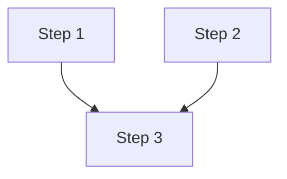

# Plan Document Schema

Plan Executor 스킬에서 생성하는 플랜 문서의 스키마 정의입니다.

## 파일 형식

플랜 문서는 **YAML frontmatter + Markdown body** 형식입니다.

```
---
(YAML frontmatter)
---

(Markdown body)
```

## YAML Frontmatter Schema

### 필수 필드

| 필드 | 타입 | 설명 |
|------|------|------|
| `plan_id` | string | UUID v4 형식의 고유 식별자 |
| `title` | string | 플랜 제목 |
| `created_at` | string | ISO 8601 형식 생성 시간 |
| `status` | enum | 플랜 상태 |

### 선택 필드

| 필드 | 타입 | 기본값 | 설명 |
|------|------|--------|------|
| `updated_at` | string | created_at | 마지막 수정 시간 |
| `version` | number | 1 | 플랜 버전 |
| `author` | string | "claude" | 작성자 |
| `tags` | string[] | [] | 분류 태그 |

### Status 값

| 값 | 설명 |
|----|------|
| `draft` | 초안, 검토 대기 |
| `approved` | 승인됨, 실행 대기 |
| `in_progress` | 실행 중 |
| `completed` | 완료 |
| `abandoned` | 폐기 |

### 예시

```yaml
---
plan_id: "550e8400-e29b-41d4-a716-446655440000"
title: "User Authentication Implementation"
created_at: "2025-12-04T14:30:00Z"
updated_at: "2025-12-04T15:45:00Z"
version: 2
status: in_progress
author: claude
tags:
  - authentication
  - security
  - backend
---
```

## Markdown Body Schema

### 필수 섹션

#### 1. Summary (요약)

```markdown
## Summary

[1-2 문장으로 플랜 목적 설명]
```

#### 2. Exploration Results (탐색 결과)

```markdown
## Exploration Results

### Files Analyzed
| File | Purpose |
|------|---------|
| `path/to/file.ts` | [설명] |

### Patterns Found
- [패턴 1]
- [패턴 2]
```

#### 3. Implementation Steps (구현 스텝)

```markdown
## Implementation Steps

### Step 1: [제목]
- **Status**: pending | in_progress | completed | failed | skipped
- **Dependencies**: none | Step X, Step Y
- **Estimated Time**: [X minutes/hours]
- **Files**:
  - Create: `path/to/new.ts`
  - Modify: `path/to/existing.ts`
  - Delete: `path/to/remove.ts`
- **Actions**:
  1. [액션 1]
  2. [액션 2]
- **Acceptance Criteria**:
  - [ ] [기준 1]
  - [ ] [기준 2]
```

### 선택 섹션

#### Dependency Graph (의존성 그래프)

```markdown
## Dependency Graph


```

#### Parallel Execution Plan (병렬 실행 계획)

```markdown
## Parallel Execution Plan

| Wave | Steps | Can Parallelize | Notes |
|------|-------|-----------------|-------|
| 1 | Step 1, Step 2 | Yes | No dependencies |
| 2 | Step 3 | No | Single step |
```

#### Risks & Mitigations (위험 및 완화)

```markdown
## Risks & Mitigations

| Risk | Likelihood | Impact | Mitigation |
|------|------------|--------|------------|
| [위험 1] | Low/Medium/High | Low/Medium/High | [완화 전략] |
```

#### Test Strategy (테스트 전략)

```markdown
## Test Strategy

### Unit Tests
- [ ] [테스트 1]

### Integration Tests
- [ ] [테스트 1]

### Manual Verification
- [ ] [검증 1]
```

#### Rollback Plan (롤백 계획)

```markdown
## Rollback Plan

If implementation fails:
1. [롤백 스텝 1]
2. [롤백 스텝 2]
```

#### Execution Log (실행 로그)

```markdown
## Execution Log

| Timestamp | Step | Status | Notes |
|-----------|------|--------|-------|
| 2025-12-04 14:30 | Step 1 | completed | Types created |
| 2025-12-04 14:35 | Step 2 | in_progress | Updating config |
```

## Step Schema 상세

### Step 필드

| 필드 | 필수 | 타입 | 설명 |
|------|------|------|------|
| 제목 | Yes | string | ### Step N: [제목] |
| Status | Yes | enum | pending, in_progress, completed, failed, skipped |
| Dependencies | Yes | string | none 또는 쉼표로 구분된 스텝 목록 |
| Estimated Time | No | string | 예상 소요 시간 |
| Files | Yes | object | Create/Modify/Delete 파일 목록 |
| Actions | Yes | list | 수행할 액션 목록 |
| Acceptance Criteria | No | checklist | 완료 기준 |

### Status 전이

```
pending → in_progress → completed
            ↓
          failed
            ↓
          skipped (의존 스텝 실패 시)
```

### Dependencies 표기

```markdown
# 의존성 없음
- **Dependencies**: none

# 단일 의존성
- **Dependencies**: Step 1

# 다중 의존성
- **Dependencies**: Step 1, Step 2

# 조건부 의존성 (설명 포함)
- **Dependencies**: Step 1 (types), Step 2 (config)
```

### Files 표기

```markdown
- **Files**:
  - Create: `src/types/auth.ts`
  - Create: `src/services/auth.service.ts`
  - Modify: `src/config/app.config.ts`
  - Delete: `src/legacy/old-auth.ts`
```

## 파일 네이밍 규칙

### 형식

```
YYYY-MM-DD_slugified-title.md
```

### 예시

| 제목 | 파일명 |
|------|--------|
| User Authentication | 2025-12-04_user-authentication.md |
| API Layer Refactoring | 2025-12-04_api-layer-refactoring.md |
| Fix Login Bug | 2025-12-04_fix-login-bug.md |

### Slug 생성 규칙

```typescript
function slugify(title: string): string {
  return title
    .toLowerCase()
    .replace(/[^a-z0-9]+/g, '-')  // 알파벳/숫자 외 문자는 하이픈으로
    .replace(/^-|-$/g, '')        // 앞뒤 하이픈 제거
    .substring(0, 50);            // 최대 50자
}
```

## 저장 위치

### 기본 위치

```
project/
└── .plans/
    ├── 2025-12-04_user-auth.md
    └── 2025-12-04_api-refactor.md
```

### Task Master 연동 시

```
project/
└── .taskmaster/
    └── plans/
        ├── 2025-12-04_user-auth.md
        └── 2025-12-04_api-refactor.md
```

## 검증 규칙

### 필수 검증

1. `plan_id`가 유효한 UUID 형식인가?
2. `status`가 유효한 값인가?
3. 모든 Step에 Status가 있는가?
4. 의존성 참조가 유효한가?

### TypeScript 타입 정의

```typescript
interface PlanFrontmatter {
  plan_id: string;
  title: string;
  created_at: string;
  updated_at?: string;
  version?: number;
  status: 'draft' | 'approved' | 'in_progress' | 'completed' | 'abandoned';
  author?: string;
  tags?: string[];
}

interface Step {
  id: string;
  title: string;
  status: 'pending' | 'in_progress' | 'completed' | 'failed' | 'skipped';
  dependencies: string[];
  estimatedTime?: string;
  files: {
    create?: string[];
    modify?: string[];
    delete?: string[];
  };
  actions: string[];
  acceptanceCriteria?: string[];
}

interface PlanDocument {
  frontmatter: PlanFrontmatter;
  summary: string;
  explorationResults: {
    files: { path: string; purpose: string }[];
    patterns: string[];
  };
  steps: Step[];
  dependencyGraph?: string;
  parallelExecutionPlan?: {
    wave: number;
    steps: string[];
    canParallelize: boolean;
  }[];
  risks?: {
    risk: string;
    likelihood: 'Low' | 'Medium' | 'High';
    impact: 'Low' | 'Medium' | 'High';
    mitigation: string;
  }[];
  testStrategy?: {
    unitTests: string[];
    integrationTests: string[];
    manualVerification: string[];
  };
  rollbackPlan?: string[];
  executionLog?: {
    timestamp: string;
    step: string;
    status: string;
    notes: string;
  }[];
}
```

## 플랜 라이프사이클

```
1. Draft (초안 생성)
   ↓
2. Review (사용자 검토)
   ↓
3. Approved (승인) 또는 Abandoned (폐기)
   ↓
4. In Progress (실행 중)
   ↓
5. Completed (완료) 또는 Abandoned (폐기)
```

### 상태 전이 규칙

| From | To | Condition |
|------|-----|-----------|
| draft | approved | 사용자 승인 |
| draft | abandoned | 사용자 취소 |
| approved | in_progress | 실행 시작 |
| in_progress | completed | 모든 스텝 완료 |
| in_progress | abandoned | 사용자 중단 |
| any | draft | 재작업 필요 시 |
