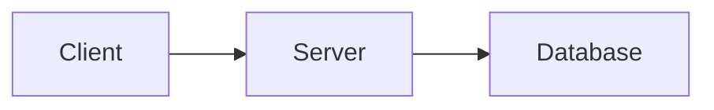

# Notion Summary - 세션 요약 및 리포트 업로드

## Overview

Claude Code 세션 요약 또는 마크다운 리포트를 Notion에 업로드하는 스킬입니다.

**두 가지 모드:**
- **Session Summary**: 현재 세션의 작업 내용을 요약하여 마크다운으로 생성 후 Notion에 업로드
- **Report Upload**: 에이전트가 생성한 상세 리포트/문서를 그대로 Notion에 업로드

**핵심 원칙:**
- **Session Summary**: 세션 히스토리를 분석하여 구조화된 요약 문서 생성
- **Report Upload**: 원본의 구조, 포맷, 내용을 손실 없이 Notion으로 전달
- **포맷 변환**: Notion 비호환 포맷(ASCII art, 마크다운 테이블)을 업로드 전 Notion 호환 형식으로 변환
- 지정된 Notion 페이지 하위에 자동 생성
- 날짜/프로젝트별 체계적 문서화

## When to Use

### Session Summary 모드

- "세션 정리해줘", "오늘 작업 요약해서 노션에 올려줘"
- "세션 요약 노션에 저장"
- "notion summary"
- 긴 작업 세션 완료 후 사용자가 정리 요청 시

### Report Upload 모드

- "노션에 업로드해줘", "결과 노션에 정리해줘"
- "리포트 노션에 올려줘", "보고서 업로드"
- "이 문서 notion에 저장해줘"
- "오늘 작업 내용 저장해줘"
- 이미 작성된 마크다운 파일이 있을 때

## Prerequisites

### 환경 변수 (필수)

```bash
# ~/.bashrc, ~/.zshrc, 또는 ~/.profile에 추가
export NOTION_TOKEN="secret_xxxxxxxxxxxxxxxxxxxx"
```

**토큰 발급 방법:**
1. https://www.notion.so/my-integrations 접속
2. "New integration" 클릭
3. 이름 지정 후 생성
4. "Internal Integration Token" 복사

### Static 파일 설정 (필수)

`~/.agents/NOTION.md` 파일에 페이지 설정:

```markdown
# Notion 설정

## 기본 페이지
- **페이지 ID**: xxxxxxxx-xxxx-xxxx-xxxx-xxxxxxxxxxxx
- **페이지 이름**: Claude 작업 기록

## 업로드 설정
- **날짜별 하위 페이지**: true
- **프로젝트별 분류**: true
```

### 의존성 설치

```bash
pip install notion-client
```

### Notion 페이지 권한 설정

1. 업로드할 Notion 페이지 열기
2. 우측 상단 `...` → "Connections" 클릭
3. 생성한 Integration 선택하여 연결

## Workflow

### Mode 1: Session Summary (세션 요약)

현재 세션 대화 내용을 분석하여 구조화된 요약을 생성한 후 Notion에 업로드합니다.

#### Step 1: 설정 확인

```bash
./scripts/notion-upload.py --check-config
```

#### Step 2: 세션 히스토리 분석 및 마크다운 생성

에이전트가 현재 세션을 분석하여 다음 구조의 마크다운 문서를 생성합니다:

```markdown
# 세션 요약 - {날짜}

## 세션 개요
- 프로젝트: {프로젝트명}
- 주요 목표: {세션의 핵심 목표}

## 수행한 작업
1. {작업 1 설명}
2. {작업 2 설명}
...

## 주요 결과물
- {생성/수정된 파일, 구현된 기능}

## 기술적 결정 사항
- {결정 내용과 이유}

## 다음 단계
- [ ] {후속 작업 1}
- [ ] {후속 작업 2}
```

생성된 마크다운을 scratchpad 또는 .context 디렉토리에 임시 파일로 저장합니다.

#### Step 3: 포맷 변환 (업로드 전)

**IMPORTANT - 업로드 전 반드시 수행:**

1. **ASCII art 다이어그램 → Mermaid 변환**: 요약에 시스템 구조도 등 ASCII art가 포함된 경우 Mermaid 문법으로 변환 (아래 "Format Conversion Rules" 참조)
2. **마크다운 테이블**: 그대로 유지 (스크립트가 자동으로 Notion 테이블 블록으로 변환)

#### Step 4: 파일 업로드

```bash
./scripts/notion-upload.py \
  --file "/path/to/session-summary.md" \
  --title "작업 제목" \
  --type "summary" \
  --project "프로젝트명"
```

제목 형식: `{YYYY-MM-DD}-{type}-{title}` (예: `2025-01-29-summary-notion-summary 스킬 개선`)

### Mode 2: Report Upload (리포트 업로드)

에이전트가 생성한 상세 리포트 또는 이미 저장된 마크다운 문서를 그대로 Notion에 업로드합니다.

#### Step 1: 설정 확인

```bash
./scripts/notion-upload.py --check-config
```

#### Step 2: 마크다운 파일 확인

세션에서 이미 저장된 마크다운 파일의 경로를 확인합니다:

```bash
# 예시: .context에 저장된 문서
ls -la .context/*.md

# 예시: mindcontext로 저장된 파일
ls -la .context/conversations/*.md
```

**IMPORTANT:**
- 파일이 있으면 파일 경로를 그대로 사용
- 파일이 없으면 에이전트가 상세 리포트를 마크다운으로 생성 후 저장
- Report Upload에서는 원본 내용을 요약하거나 축약하지 않음

#### Step 3: 포맷 변환 (업로드 전)

**IMPORTANT - 업로드 전 반드시 수행:**

문서에 ASCII art 다이어그램이 포함된 경우:
1. 파일을 읽어 ASCII art 부분을 식별
2. Mermaid 문법으로 변환
3. 변환된 내용으로 파일 업데이트 후 업로드

마크다운 테이블은 스크립트가 자동 처리하므로 변환 불필요.

#### Step 4: 파일 직접 업로드

```bash
# 파일 경로만 전달
./scripts/notion-upload.py \
  --file "/path/to/report.md" \
  --type "report" \
  --project "프로젝트명"

# 여러 파일 업로드
./scripts/notion-upload.py --file "plan.md" --type "plan" --project "my-project"
./scripts/notion-upload.py --file "analysis.md" --type "analysis" --project "my-project"
```

**업로드 옵션:**
- `--file`: 마크다운 파일 경로 (필수)
- `--title`: 문서 제목 (미지정 시 파일명 사용)
- `--type`: 문서 타입 (`summary`, `report`, `plan`, `analysis` 등). 제목에 포함
- `--project`: 프로젝트명

**제목 형식:** `{YYYY-MM-DD}-{type}-{title}` (예: `2025-01-29-report-api-design`)

## Format Conversion Rules

### 마크다운 테이블 → Notion 테이블 블록 (자동)

스크립트(`notion-upload.py`)가 마크다운 테이블 문법을 자동으로 Notion 테이블 블록으로 변환합니다.
에이전트가 별도로 처리할 필요 없습니다.

지원 형식:

```
| 헤더1 | 헤더2 | 헤더3 |
|-------|-------|-------|
| 셀1   | 셀2   | 셀3   |
| 셀4   | 셀5   | 셀6   |
```

변환 결과: Notion 네이티브 테이블 (첫 행이 헤더로 표시)

### ASCII Art 다이어그램 → Mermaid (에이전트 수동 변환)

Notion은 ASCII art를 제대로 렌더링하지 못합니다.
**업로드 전에 에이전트가 ASCII art를 Mermaid 다이어그램으로 변환해야 합니다.**

Mermaid는 코드 블록(````mermaid`)으로 작성하면 스크립트가 Notion 코드 블록으로 업로드합니다.

**변환 예시:**

변환 전 (ASCII art):
```
┌──────────┐     ┌──────────┐     ┌──────────┐
│  Client   │────→│  Server   │────→│ Database  │
└──────────┘     └──────────┘     └──────────┘
```

변환 후 (Mermaid):


**다이어그램 타입별 변환 가이드:**

| ASCII 패턴 | Mermaid 타입 | 예시 |
|------------|-------------|------|
| 박스 + 화살표 (좌→우) | `graph LR` | 시스템 아키텍처 |
| 박스 + 화살표 (위→아래) | `graph TD` | 플로우차트 |
| 시간순 메시지 교환 | `sequenceDiagram` | API 호출 흐름 |
| 상태 전이 | `stateDiagram-v2` | 상태 머신 |
| 클래스/모듈 관계 | `classDiagram` | 클래스 다이어그램 |

**변환 가이드라인:**
- `┌─┐`, `└─┘`, `│`, `───`, `→` 등의 박스/화살표 패턴 → `graph` 노드+엣지
- 세로 구조 → `graph TD` (Top-Down)
- 가로 구조 → `graph LR` (Left-Right)
- 변환이 어려운 복잡한 ASCII art → 코드 블록(`plain text`)으로 유지

**참고:** Notion은 Mermaid를 네이티브로 렌더링하지 않지만, 코드 블록으로 표시되어 가독성이 유지되며, 일부 Notion 확장이 Mermaid를 렌더링합니다.

## Examples

### 예시 1: Session Summary 모드

```
사용자: 오늘 세션 정리해서 노션에 올려줘

Claude: 현재 세션을 분석하여 요약을 생성합니다.

[세션 분석 중...]

📝 세션 요약 생성 완료:
- 세션 개요, 수행 작업, 결과물, 결정 사항, 다음 단계 포함
- 시스템 구조도를 Mermaid 다이어그램으로 변환

📄 /tmp/session-summary-2025-01-29.md (1,850자)

Notion에 업로드합니다.

✅ 업로드 완료
- 제목: 세션 요약 - 2025-01-29
- Notion 블록: 35개
- URL: https://notion.so/xxxxx
```

### 예시 2: Report Upload 모드

```
사용자: 방금 작성한 설계서를 노션에 업로드해줘

Claude: 저장된 파일을 확인합니다.

📄 .context/plans/api-design.md (2,450자)

ASCII art 다이어그램 발견 → Mermaid로 변환합니다.
마크다운 테이블 3개 → Notion 테이블로 자동 변환됩니다.

이 파일을 Notion에 업로드합니다.

✅ 업로드 완료
- 제목: api-design
- Notion 블록: 47개
- URL: https://notion.so/xxxxx
```

### 예시 3: 포맷 변환이 포함된 업로드

```
사용자: 아키텍처 문서 노션에 올려줘

Claude: 문서를 확인합니다.

📄 .context/architecture.md (3,200자)

⚠️ 포맷 변환 필요:
- ASCII art 시스템 구조도 → Mermaid graph LR로 변환
- ASCII art 시퀀스 다이어그램 → Mermaid sequenceDiagram으로 변환
- 마크다운 테이블 2개 → Notion 테이블 자동 변환

변환 완료 후 업로드합니다.

✅ 업로드 완료
- 제목: architecture
- Notion 블록: 62개
- URL: https://notion.so/xxxxx
```

### 예시 4: 설정 없을 때

```
사용자: 노션 업로드해줘

Claude: ⚠️ 노션 설정이 필요합니다.

1. NOTION_TOKEN 환경 변수를 설정해주세요:
   export NOTION_TOKEN="secret_xxx"

2. ~/.agents/NOTION.md 파일을 생성해주세요:
   페이지 ID와 업로드 설정을 포함해야 합니다.

자세한 설정 방법을 안내해드릴까요?
```

## Configuration

### ~/.agents/NOTION.md 구조

```markdown
# Notion 설정

## 기본 페이지
- **페이지 ID**: xxxxxxxx-xxxx-xxxx-xxxx-xxxxxxxxxxxx
- **페이지 이름**: Claude 작업 기록

## 업로드 설정
- **날짜별 하위 페이지**: true
- **프로젝트별 분류**: true
- **기본 프로젝트명**: general

## 콘텐츠 템플릿
### 포함 항목
- 세션 요약: true
- 작업 결과물: true
- 파일 변경 사항: true
- 실행 명령어: false
```

### 환경 변수 옵션

| 변수 | 필수 | 설명 |
|------|------|------|
| `NOTION_TOKEN` | 필수 | Notion Integration 토큰 |
| `NOTION_PAGE_ID` | 선택 | 기본 페이지 ID (static 파일보다 우선) |

## Best Practices

**DO:**
- Session Summary 시 세션 전체를 분석하여 구조화된 요약 생성
- Report Upload 시 이미 저장된 파일 경로를 그대로 사용
- ASCII art 다이어그램은 업로드 전 Mermaid로 변환
- 테이블이 포함된 문서도 그대로 업로드 (자동 변환됨)
- `--file` 옵션으로 파일 직접 업로드
- 토큰은 반드시 환경 변수로 관리
- 민감 정보 제외 확인

**DON'T:**
- Session Summary에서 대화 원문을 그대로 복사하지 않기 (구조화된 요약 생성)
- Report Upload에서 문서 내용을 요약하거나 축약하지 않기 (원본 보존)
- ASCII art를 변환하지 않고 그대로 업로드하지 않기
- 파일 내용을 다시 읽어서 `--content`로 전달하지 않기
- 토큰을 코드나 설정 파일에 하드코딩하지 않기

## Troubleshooting

### 문제 1: 인증 실패

```
Error: Invalid token
```

해결:
1. 토큰 유효성 확인: `echo $NOTION_TOKEN`
2. Integration이 페이지에 연결되었는지 확인
3. 토큰 재발급 필요 시 my-integrations에서 재생성

### 문제 2: 페이지 없음

```
Error: Page not found
```

해결:
1. 페이지 ID가 올바른지 확인
2. Integration이 해당 페이지에 접근 권한이 있는지 확인
3. Notion 페이지 → Connections에서 Integration 연결

### 문제 3: Static 파일 없음

```
Warning: NOTION.md not found
```

해결:
```bash
# 템플릿 생성
cat > ~/.agents/NOTION.md << 'EOF'
# Notion 설정

## 기본 페이지
- **페이지 ID**: [여기에 페이지 ID 입력]
- **페이지 이름**: Claude 작업 기록

## 업로드 설정
- **날짜별 하위 페이지**: true
- **프로젝트별 분류**: true
EOF
```

### 문제 4: 테이블이 Notion에서 깨짐

마크다운 테이블이 Notion 테이블로 변환되지 않는 경우:
1. 테이블 형식 확인: 각 행이 `|`로 시작하고 `|`로 끝나야 함
2. 두 번째 행이 separator (`|---|---|`)인지 확인
3. `--dry-run`으로 변환 결과 미리 확인

## Security

이 스킬은 다음 보안 규칙을 따릅니다:

1. **토큰 보호**: `NOTION_TOKEN`은 환경 변수로만 관리
2. **민감 정보 필터링**: 업로드 전 API 키, 비밀번호 패턴 검사
3. **static-index 연동**: `~/.agents/SECURITY.md` 규칙 적용
4. **업로드 확인**: 사용자 확인 후 업로드 (기본 동작)

## Resources

| 파일 | 설명 |
|------|------|
| `scripts/notion-upload.py` | Notion API 업로드 스크립트 |
| `~/.agents/NOTION.md` | 사용자 노션 설정 (static-index 참조) |

## Integration with Other Skills

| 스킬 | 연동 방식 |
|------|----------|
| static-index | NOTION.md 파일 경로 조회 |
| security-auditor | 업로드 전 민감 정보 검사 |
| mindcontext | 세션 컨텍스트 저장 후 Notion 업로드 연동 |
| git-commit-pr | 커밋 후 자동 문서화 연동 가능 |
